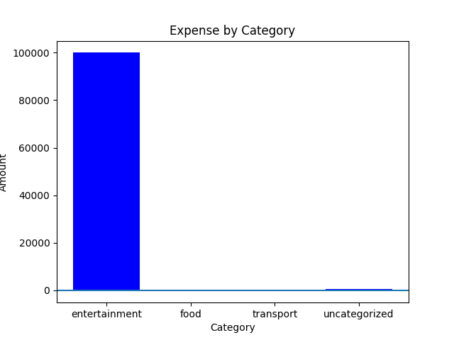
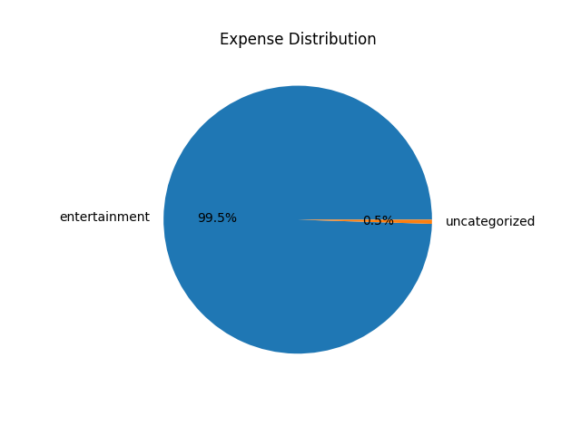

# 💰 AI Finance Monthly Report

---

## 📊 Overview
- **Monthly Income:** 10,000.00
- **Total Expenses:** 100,300.00
- **Remaining Balance:** -90,300.00
- **Top Category:** Entertainment

---

## 🍔 Expense Breakdown

| Category | Amount |
| --- | --- |
| Entertainment | 100,000.00 |
| Food | -200.00 |
| Transport | 0.00 |
| Uncategorized | 500.00 |

---

## ⚠️ Budget Analysis

| Category | Status | Difference |
| --- | --- | --- |
| Entertainment | overspent | -98,000.00 |
| Food | not_used | 3,000.00 |
| Transport | not_used | 1,500.00 |
| Uncategorized | unplanned | -500.00 |

---

## 💡 Savings Plan
- **Recommended Target:** 0.00

---

## 📈 Forecast
- **Predicted Next Spending:** 79,700.00

---

## 📊 Charts

---

## 📈 Insight
You are overspending ⚠️.

⚠️ Spending trend is increasing. You may overspend next month.

---

✨ Generated by AI Finance Assistant
